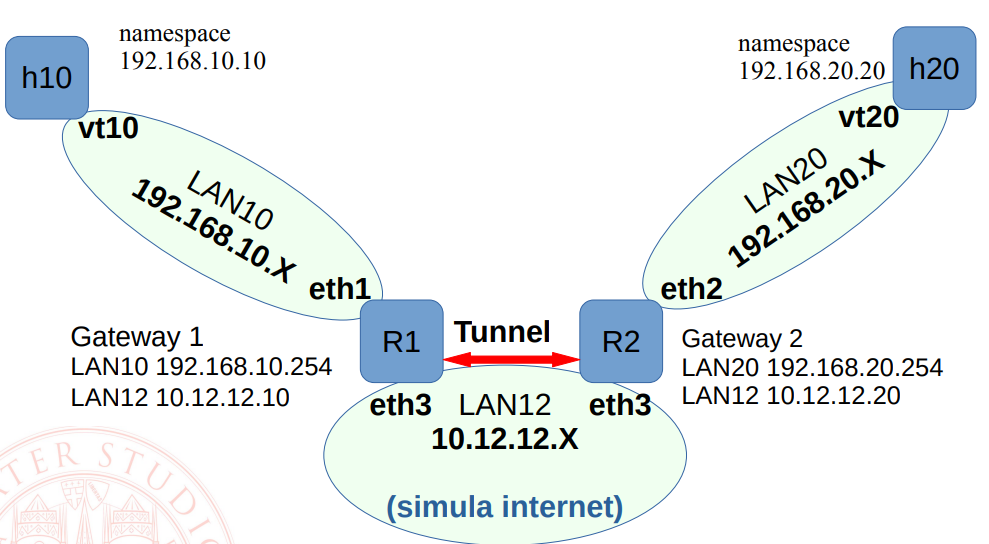

# iptables

## Consegna 

```
Realizzare tre estensioni degli esempi proposti:

1) scrivere il procedimento per riuscire a inserire, in FORWARD di R1 e R2, una regola di log nella posizione specifica subito prima delle regole DROP del traffico sulla porta 22, in modo da registrare i pacchetti che non vengono accettati dalle regole iniziali (che consentono le connessioni ssh da H10 a H20) 

2) rimuovere  da H20 la regola di routing che utilizza R2 come default gateway, e inserire su R2 una regola di NAT tale per cui il traffico ssh in arrivo attraverso la vpn e diretto a H20 venga mascherato perché appaia provienente da R2 stesso, impostando come indirizzo sorgente 192.168.20.254

3) inserire su H10 e H20 regole per imporre vincoli su ssh analoghi a quelli inseriti sui gateway: H10 si deve solamente poter collegare via ssh a "H20" (ricordate che in realtà avendo fatto i NAT si collegherà a R1), e H20 deve solo poter ricevere connessioni ssh da "host1" (che sembreranno provenire da R2)

Le virgolette ci ricordano che sono in azione i NAT... host1 e host2 avranno visione di una realtà di rete falsata, ma l'effetto finale è che si deve fare quanto di meglio possibile per ottenere l'obiettivo richiesto. Cosa non è possibile distinguere?
```

## Soluzione

Prima di tutto, l'esercizio non lo specifica, ma si fa riferimento all'architettura delle slides sulla VPN/IPSec. Dunque, dobbiamo tirare su l'architettura. Consiglio inoltre di lavorare direttamente sulla VM per questi esercizi, siccome si possono fare dei casini con iptables, eliminando per esempio le regole tirate su da Docker.  

La nostra rete avrà questa topologia:



Dunque, cominciamo. 
Eseguiamo lo script nella cartella (come root, se non ti fidi puoi controllare il codice di cosa fa esattamente lo script):
```bash
./crea_rete.sh
```
Dentro entrare nel container R1 e R2:
```bash
# da una shell
docker exec -it R1 sh
# da un'altra shell
docker exec -it R2 sh
```
eseguire questi comandi, che servono per installare dipendenze varie: 
``` bash
apk add strongswan
apk add openvpn
```

Per testare, eseguire i seguenti comandi:
```
deve funzionare da h10 a GW1 e viceversa
(da host) ip netns exec h10 ping 192.168.10.254
(da R1) ping 192.168.10.10

deve funzionare da h20 a GW2 e viceversa	
(da host)ip netns exec h20 ping 192.168.20.254
(da R2) ping 192.168.20.20

deve funzionare da GW1 a GW2 e viceversa
(da R1) ping 10.12.12.20
(da R2) ping 10.12.12.10

non deve funzionare per le altre coppie possibili
(da host) ip netns exec h10 ping 192.168.20.20 
(da R1) ping 192.168.20.20
```

Se i test vanno, allora abbiamo creato la rete, e possiamo continuare con l'esercizio. 
Consiglio di fare il flushing delle regole con `iptables -F` per iniziare. 

### Esercizio 1

Dobbiamo scrivere prima di tutto delle regole che facciano il drop dei pacchetti nella porta 22, ma che consentono la comunicazione tramite ssh tra H10 e H20.
H10 ha ip `192.168.10.10`, mentre H20 ha ip `192.168.20.20`. Il tutto nella catena FORWARD.

Quindi inseriamo le regole:
```
iptables -I FORWARD -p tcp --dport 22 -j DROP
iptables -I FORWARD -p tcp --sport 22 -j DROP
iptables -I FORWARD -p tcp  -s 192.168.10.10 -d 192.168.20.20 --sport 22 -j ACCEPT
iptables -I FORWARD -p tcp  -s 192.168.10.20 -d 192.168.20.10 --dport 22 -m state --state ESTABLISHED -j ACCEPT
```
L'ultima regola in particola accetta pacchetti SSH provenienti da H20 solo se la connesione è ESTABLISHED, ovvero se è già stata instaurata da H10.

**RICORDA**: il flag `-I` permette l'inserimento in testa delle regole. Se le volessimo inserire in coda, dobbiamo usare il flag `-A` e invertire l'ordine delle operazioni. 

Ora, dobbiamo fare in modo che vengano loggati i pacchetti che sono stati droppati, quindi dovremmo loggarti subito prima che questi vengano effettivamente droppati.
Dunque, dobbiamo scrivere la regola in una posizione specifica, ovvero subito prima del DROP sulla porta 22.

Vediamo le regole che abbiamo inserito e la loro posizione:
```
iptables -t FORWARD -nL --line-numbers
```
Notereme che la nostra regola andrà messa subito l'ultima ACCEPT, quindi va in posizione 3. 
```
iptables -I FORWARD 3 -j LOG --log-prefix "Pacchetto ssh droppato"
```

Testiamo pingando `google.com`, e poi l'ip di H10. 

**NOTA**: Notiamo che R1 e R2 non hanno ssh dentro, quindi sto esercizio è un po' useless. Ho anche provato con netcat, ma non va... 

### Esercizio 2
Per rimuovere la regola, esaminiamo i comadni di configurazione della rete privata locale, e usiamo il comando:
```
ip netns exec h20 ip route del default via 192.168.20.254
```
Per rimuovere il default gateway.

Dobbiamo poi inserire su R2 una regola di NAT tale per cui il traffico ssh in arrivo attraverso la vpn e diretto a H20 venga mascherato perché appaia provienente da R2 stesso, impostando come indirizzo sorgente 192.168.20.254

Per mascherare l'indirizzo ip, dobbiamo usare la catena POSTROUTING (siccome dobbiamo fare tutte queste operazioni dopo che il pacchetto sia stato "controllato" dal firewall) del gruppo nat (quest'ultimo perché ce lo chiede la consegna).
```
iptables -t nat -I POSTROUTING -s 192.168.10.0/24 -d 192.168.20.0/24 -j SNAT --to-source 192.168.20.254
```

### Esercizio 3

Per fare questo esercizio, è necessaria una buona compresione delle VPN, cosa che io non ho. Quindi so long, vedete la soluzione del prof. 
